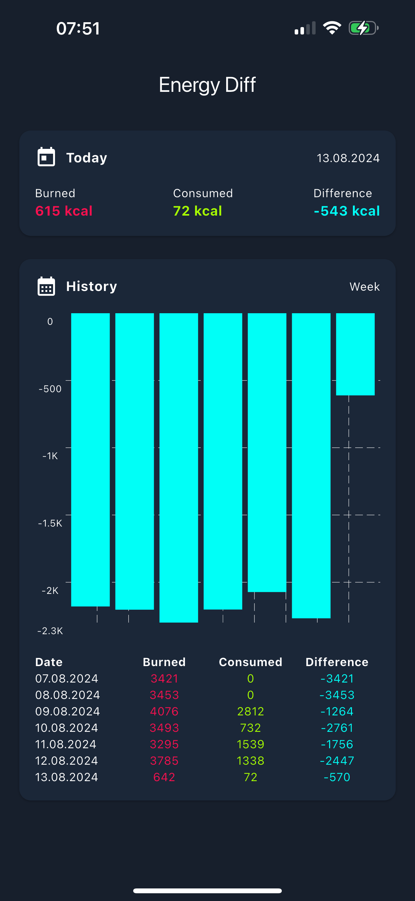

# Energy Diff

Engery Diff is an iOS app written created using Flutter, which shows the
difference between the burned and consumed energery based on your data from
Apple Health.



```bash
# Launch emulator and run the app
flutter emulators --launch apple_ios_simulator
flutter run -d "iPhone 15"

# Run the app on a device
flutter devices
flutter run --device-id=<DEVICE>
flutter run --release --device-id=<DEVICE>

# Sort imports
flutter pub run import_sorter:main

# Generate app icons and splash screen
flutter pub run flutter_launcher_icons:main
flutter pub run flutter_native_splash:create
```
